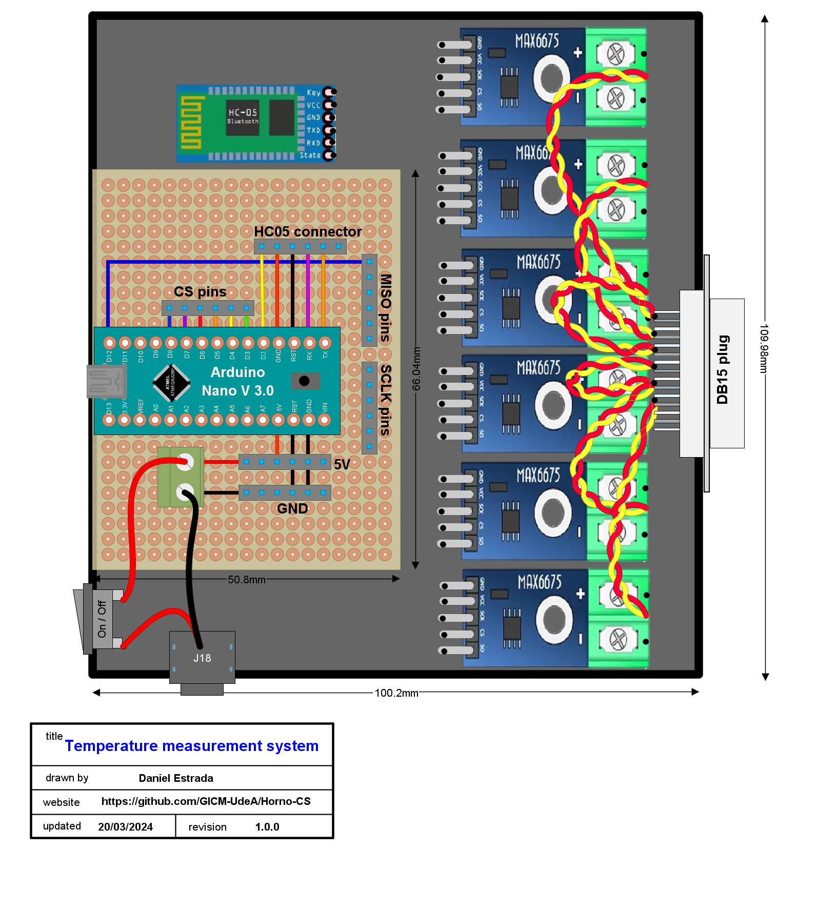

# Diseño del PCB

Por cuestiones de tiempo no se hizo un diseño de PCB a medida para mandar a fabricar y soldar los componentes. En su lugar se está usando un PCB universal para organizar los componentes como se muestra en la Figura. El diseño se realizó con ayuda del software [DIY Layout creator](https://diy-fever.com/software/diylc/), ya que es liviano y fácil de usar, flexible en cuanto a la creación de componentes y permite exportar en formatos como PDF y PNG. 

<figure>
    
</figure>

Los cables entrelazados que conectan el MAX6675 y los conectores hembra para termocupla representan cables Alumel-Cromel. Y las conexiones entre cada módulo MAX6675, el HC05 y la PCB no se dibujaron para no saturar la imagen. 